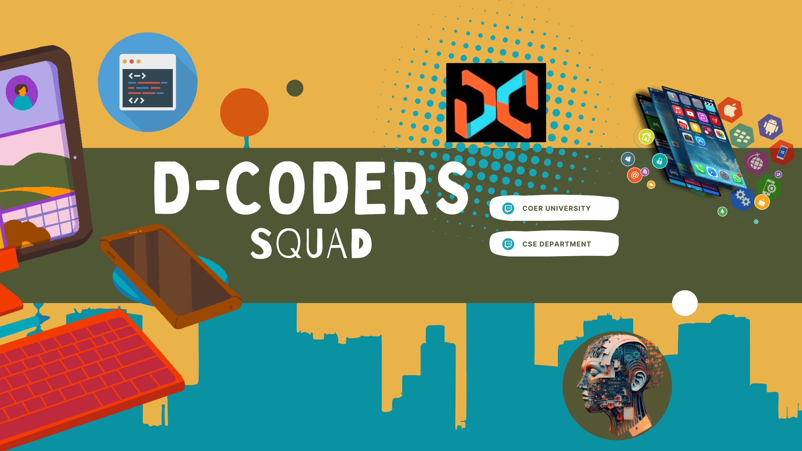

<p align="center">
  
</p>

<div align="center">

# ⚡ D-Coders Squad ⚡
  **COER University | CSE Department**

</div>

<p align="center">
  <a href="https://www.linkedin.com/groups/14523464/">
    
  </a> 
  <a href="https://www.instagram.com/coer.university/?hl=en">
  
  </a>
</p>

<br>

<div align="center">

[Introduction](#-introduction) &nbsp; [Our Groups](#-our-groups) &nbsp; [Tech Stack](#-tech-stack) &nbsp; [Projects](#-projects) &nbsp; [Acknowledgements](#-acknowledgements) &nbsp; [How to Contribute](#-how-to-contribute) 

</div>

<br>

# 👋 Introduction

**D-Coders Squad** is an innovative and dynamic student community under the **CSE Department at COER University**, dedicated to nurturing talent in cutting-edge technologies.  
Founded under the guidance of **Dr. Deepak Painuli (HOD, CSE)**, the squad empowers students through hands-on learning, hackathons, expert-led workshops, and collaborative projects.

<br>

# 💡 Our Groups

We are proud to run multiple learning and project groups:
- 💻 **Competitive Coding**
- 🤖 **Machine Learning**
- 🔬 **Research & Development**
- 🌐 **Web Development**
- 📱 **App Development**
- 🎨 **Graphics Designing**

Together, we focus on **creativity**, **technical excellence**, and **peer-to-peer growth**, making D-Coders Squad a launchpad for future tech leaders.

<br>

# ⚙️ Tech Stack

This website is built with:
- **Frontend**: React.js, Tailwind CSS
- **Deployment**: Netlify

<br>

# 🚀 Projects

The official D-Coders Squad website will showcase:
- 🏆 Squad Highlights & Events
- 📂 Projects & Hackathons
- 🎓 Resources & Blogs
- 🧩 Member Profiles

<br>

# 🎖 Acknowledgements
A big thank you to **Dr. Deepak Painuli (HOD, CSE)** for his vision and support for D-Coders Squad.
And to all our squad members for their dedication and passion to learn!

<br>

# 🤝 How to Contribute

Want to contribute? Awesome!  
- Clone the repo
- Create a branch for your feature
- Commit changes with clear messages
- Open a Pull Request for review

```bash
git clone https://github.com/TyagiManshi/d-coders-squad.git
```
